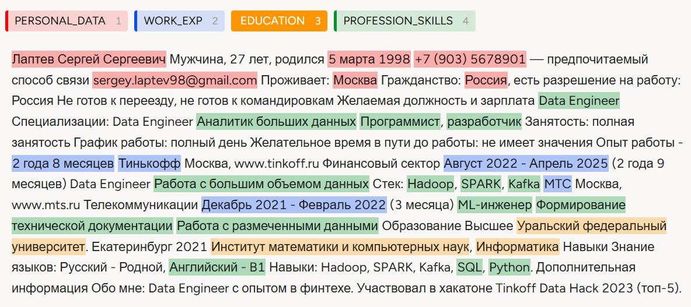

# Документация для Flask-приложения

# `main.py`

Этот скрипт представляет собой Flask-приложение, которое позволяет загружать резюме, извлекать из них ключевые данные и сравнивать их с требованиями к вакансиям. Основная цель проекта — создание матрицы компетенций, которая помогает оценить соответствие кандидата требованиям вакансии.

## Подробное описание компонентов

### 1. Импорт необходимых библиотек

- `os` для работы с файловой системой.
- `Flask` для создания веб-приложения.
- `request` и `render_template` для обработки запросов и рендеринга шаблонов.
- `secure_filename` для безопасного сохранения загруженных файлов.
- `SentenceTransformer` и `util` для работы с моделью обработки текста.
- `extract_entities` для извлечения сущностей из текста.
- `pandas` для работы с табличными данными.
- `numpy` для работы с числовыми данными.

### 2. Список университетов и ключевых слов

```python
university_tier_list = {
    "ИТМО": 1,
    "МФТИ": 1,
    "Московский физико-технический институт": 1,
    "ВШЭ": 1,
    "Ломоносова": 1,
    "Высшая школа экономики": 1,
    "СПБГУ": 1,
    "Санкт-Петербургский государственный университет": 1,
    "МГУ": 1,
    "Московский государственный университет": 1,
    "МГТУ им. Н. Э. Баумана": 2,
    "МГТУ": 2,
    "Баумана": 2,
    "УРФУ": 2,
    "Уральский федеральный университет": 1,
    "Иннополис": 2,
    "Ельцина": 2,
    "Санкт-Петербургский политехнический университет Петра Великого": 1,
    "МИСИС": 2,
    "МИФИ": 2,
    "МИРЭА": 2,
    "Южный федеральный университет": 2,
    "ЮФУ": 2,
    "Финансовый университет при правительстве Российской Федерации": 2,
    "Финансовый университет": 2,
    "Финсовый при правительстве": 2,
    "КФУ": 2,
    "НГУ": 2,
    "Российский технологический университет": 2,
    "МАИ": 2,
    "Московский авиационный": 2
}
```

Каждый ключ в словаре представляет собой название университета, а значение — его рейтинг (тир). Рейтинг составлен на основнове рейтинга[ Альянса в сфере ИИ.]([https://rating.a-ai.ru/#rating]())

```python
def get_university_score(education_str):
    for uni, tier in university_tier_list.items():
        if uni.lower() in education_str.lower():
            return uni, tier
    return "Неизвестно", 3
```

Словарь эпитетов:

```python
expert_keywords = ["эксперт", "глубокое знание", "профессионал", "экспертный уровень", "специалист"]
advanced_keywords = ["продвинутый", "опыт работы", "уверенное владение"]
basic_keywords = ["базовый", "основы", "начальный"] 
```

Этот словарь используется для определения уровня владения навыком кандидата. Каждый список ключевых слов соответствует определённому уровню владения навыком:

1. **expert_keywords** : Содержит ключевые слова, которые указывают на экспертный уровень владения навыком.
2. **advanced_keywords** : продвинутый уровень владения навыком.
3. **basic_keywords** : базовый уровень владения навыком.

Эти списки ключевых слов используются в функции `get_candidate_level`

### 3. Проверка разрешенных файлов и чтение файла

```python
def allowed_file(filename):
    return '.' in filename and filename.rsplit('.', 1)[1].lower() in ALLOWED_EXTENSIONS

def read_file(file_path):
    with open(file_path, 'r', encoding='utf-8') as f:
        return f.read()
```

Функция `allowed_file` проверяет, разрешено ли расширение загружаемого файла. Функция `read_file` читает содержимое файла по заданному пути.

### 4. Определение уровня владения навыком

```python
def get_candidate_level(skill, profession_skills):
    skill_lower = skill.lower()
    text_lower = profession_skills.lower()

    matches = [word for word in profession_skills.split() if skill_lower in word.lower()]
    if not matches:
        return 0, ""

    matched_word = matches[0]

    tokens = text_lower.split()
    for i, token in enumerate(tokens):
        if skill_lower in token:
            if i > 0:
                previous_word = tokens[i - 2]
                if any(word in previous_word for word in expert_keywords):
                    return 3, matched_word
                elif any(word in previous_word for word in advanced_keywords):
                    return 2, matched_word
                elif any(word in previous_word for word in basic_keywords):
                    return 1, matched_word
                else:
                    return 1, matched_word
            else:
                return 1, matched_word

    return 1, matched_word
```

Эта функция определяет уровень владения навыком на основе ключевых слов из списка:

```python
expert_keywords = ["эксперт", "глубокое знание", "профессионал", "экспертный уровень", "специалист"]
advanced_keywords = ["продвинутый", "опыт работы", "уверенное владение"]
basic_keywords = ["базовый", "основы", "начальный"]
```

### 5. Сравнение навыков кандидата с требованиями вакансии

```python
def compare_with_matrix(profession_skills, selected_job):
    df = pd.read_csv("matrix.csv", sep=';')
    results = []
    ideal_vector = []
    candidate_vector = []

    for _, row in df.iterrows():
        skill = row['Skill']
        required_level = row.get(selected_job, np.nan)
        if pd.isna(required_level):
            continue

        candidate_level, matched_word = get_candidate_level(skill, profession_skills)

        ideal_vector.append(int(required_level))
        candidate_vector.append(candidate_level)

        results.append({
            'skill': skill,
            'matched_resume_skill': matched_word,
            'required_level': int(required_level),
            'candidate_level': candidate_level,
            'match_percentage': min(100, round((candidate_level / int(required_level)) * 100, 2)) if candidate_level else 0
        })

    similarity = util.cos_sim(np.array([candidate_vector], dtype=np.float32),
                              np.array([ideal_vector], dtype=np.float32)).item()

    return results, similarity * 100
```

Файл `matrix.csv` содержит матрицу компетенций. Структура файла:

```csv
Skill,DATA_SCIENTIST,DATA_ENGINEER,TECHNICAL_ANALYST_IN_AI,MANAGER_IN_AI
Python,3,2,2,1
SQL,2,3,2,1
...,3,1,2,0
```

- **Skill:** Название навыка.
- **DATA_SCIENTIST, DATA_ENGINEER, ...:** Требуемые уровни для каждой профессии.

Извлекаем навык и требуемый уровень для выбранной вакансии. Используем функцию `get_candidate_level` для определения уровня владения навыком кандидатом.Добавляем требуемый уровень и уровень кандидата в соответствующие векторы. Формируем словарь с результатами. Вычисляем косинусное сходство между векторами навыков кандидата и идеального кандидата.

### 6. Основной код приложения

```python
@app.route('/', methods=['GET', 'POST'])
def upload_resume():
    if request.method == 'POST':
        if 'resume' not in request.files:
            return "No file part"
        file = request.files['resume']
        if file.filename == '':
            return "No selected file"
        if file and allowed_file(file.filename):
            filename = secure_filename(file.filename)
            filepath = os.path.join(app.config['UPLOAD_FOLDER'], filename)
            os.makedirs(app.config['UPLOAD_FOLDER'], exist_ok=True)
            file.save(filepath)

            resume_text = read_file(filepath)

            raw_results = extract_entities(resume_text)

            df = pd.DataFrame([raw_results])
            df = df.applymap(lambda x: (
                x.replace(" ##", "")
                .replace("##", "")
                .replace("  ", " ")
                .replace(" @ ", "@")
                .replace(" . ", ".")
                .strip()
            ) if isinstance(x, str) else x)

            cleaned = df.iloc[0].to_dict()

            selected_job = request.form['job_role']

            profession_skills = cleaned.get('PROFESSION_SKILLS', '')
            education = cleaned.get('EDUCATION', '')
            work_experience = cleaned.get('WORK_EXP', '')

            comparison_result, similarity_score = compare_with_matrix(profession_skills, selected_job)
            candidate_skills = [r['matched_resume_skill'] for r in comparison_result if r['matched_resume_skill']]

            university, university_score = get_university_score(education)

            matrix = {
                'comparison_result': comparison_result,
                'candidate_skills': candidate_skills,
                'university': university,
                'university_score': university_score,
                'similarity_score': round(similarity_score, 2)
            }

            return render_template('index.html', cleaned=cleaned, matrix=matrix, selected_job=selected_job, work_exp=work_experience)

    return render_template('index.html')
```

Этот код обрабатывает загрузку резюме, извлечение данных. Используем функцию `extract_entities` для извлечения сущностей из текста резюме. Преобразуем данные в DataFrame. Извлекаем данные о выбранной вакансии, профессиональных навыках, образовании и опыте работы из формы и очищенных данных. Используем функцию `compare_with_matrix` для сравнения навыков кандидата с требованиями вакансии, используем функцию `get_university_score` для определения рейтинга университета. Формируем словарь с результатами сравнения и дополнительной информацией.

---

# Разметка данных с помощью Label Studio

Разметка данных с помощью Label Studio позволяет структурировать текстовые данные, выделяя ключевые сущности. Это упрощает дальнейший анализ и сравнение кандидатов с требованиями вакансий. Размеченные данные мы используем для обучения моделей машинного обучения или для автоматизации процесса отбора кандидатов.

При создании нового проекта в Label Studio выбираем шаблон **Named Entity Recognition (NER),** используем следующий код в разделе **Labeling Interface** для настройки меток:

```xml
<View>
  <Labels name="label" toName="text">
    <Label value="PERSONAL_DATA" background="#ff0000"/>
    <Label value="WORK_EXP" background="#004cff"/>
    <Label value="EDUCATION" background="#ff9500"/>
    <Label value="PROFESSION_SKILLS" background="#00942c"/>
  </Labels>
  <Text name="text" value="$text"/>
</View>
```

На изображении ниже показан пример разметки резюме:



* **PERSONAL_DATA** : "Патеев Сергей Сергеевич 5 марта 1998 +7 (903) 567-89-01 sergeylaptev98@gmail.com Москва Россия".
* **WORK_EXP** : "2 года 8 месяцев Тинькофф Август 2022 - Апрель 2025 МТС Декабрь 2021 - Февраль 2022".
* **EDUCATION** : "Уральский федеральный университет Институт математики и компьютерных наук Информатика".
* **PROFESSION_SKILLS**: "Data Engineer Аналитик больших данных Программист разработчик Работа с большим объемом данных Hadoop Spark Kafka ML-инженер Формирование технической документации Работа с размеченными данными Англиский - B1 SQL Python".

---

# Документация для скрипта обучения модели NER

### Обоснование использования

NLP-методы, особенно те, что используют машинное обучение, имеют значительные преимущества перед подходами без ML. Они обеспечивают контекстуальное понимание текста, например, различая смысл слова "bank" в зависимости от окружения, чего не могут сделать методы на основе регулярных выражений. NLP-модели также могут работать со сложными конструкциями языка, синонимами, аббревиатурами и опечатками, а предобученные модели позволяют быстро адаптироваться под различные задачи. В отличие от традиционных методов, требующих создания специфических шаблонов для каждой задачи и каждого языка, NLP поддерживает многоязычность и автоматизацию анализа больших объемов данных.

## `tokenizer.py`

Этот код предназначен для обучения модели распознавания именованных сущностей (NER) с использованием архитектуры BERT. Он включает в себя несколько этапов: загрузка и подготовка данных, токенизация и выравнивание меток, инициализация модели, настройка процесса обучения, само обучение и оценка модели, а также сохранение результатов.

### 1. Загрузка и подготовка данных

Данные для обучения загружаются из JSON-файла `upd_NER.json.json`. Этот файл содержит текстовые данные, разбитые на токены, и соответствующие им метки именованных сущностей.

```python
with open('upd_NER.json.json', 'r', encoding='utf-8') as f:
    ner_data = json.load(f)
```

Затем данные преобразуются в формат, удобный для работы с библиотекой `datasets`:

```python
dataset = Dataset.from_dict({
    "tokens": [item["tokens"] for item in ner_data],
    "ner_tags": [item["ner_tags"] for item in ner_data]
})
```

Формат данных в JSON-файле выглядит следующим образом:

[
  {
    "tokens": ["токен1", "токен2", ...],
    "ner_tags": ["метка1", "метка2", ...]
  },
  ...
]

### 2. Анализ и подготовка меток

На этом этапе скрипт анализирует распределение меток в данных. Это помогает понять, какие метки встречаются чаще всего, а какие — реже.

```python
all_tags = [tag for tags in dataset["ner_tags"] for tag in tags]
tag_counts = Counter(all_tags)
print("Частота меток:", tag_counts)
```

Затем создаются словари для преобразования меток в числовые идентификаторы и обратно. Это необходимо для того, чтобы модель могла работать с метками в числовом формате.

```python
unique_labels = sorted(set(tag for tags in dataset["ner_tags"] for tag in tags))
label_to_id = {label: i for i, label in enumerate(unique_labels)}
id_to_label = {i: label for label, i in label_to_id.items()}
```

### 3. Токенизация данных

`AutoTokenizer` используется для автоматизированной загрузки соответствующего токенизатора, подходящего к выбранной предобученной модели. Он обеспечивает корректную обработку специальных символов, аббревиатур, опечаток и автоматически управляет длиной последовательности с учетом параметра `max_length`. Это делает `AutoTokenizer` эффективным инструментом при решении задач обработки естественного языка, таких как распознавание именованных сущностей (NER) и классификация текста. В контексте данного проекта он используется для точной токенизации текста резюме с целью извлечения сущностей, связанных с профессиональными навыками, образованием и опытом работы.

Для токенизации текста используется многоязычный токенизатор BERT анализирует текст в контексте, учитывая как левую, так и правую сторону каждого слова. Это делает её более точной по сравнению с традиционными методами, такими как регулярные выражения. Мы используем многоязычную версию BERT (`bert-base-multilingual-cased`), которая поддерживает работу с текстами на разных языках.

Для решения задачи распознавания именованных сущностей (NER) используется предобученная модель `bert-base-multilingual-cased`, которая была дополнительно дообучена на размеченных вручную данных. Это позволяет повысить точность идентификации ключевых категорий, таких как профессиональные навыки, образование и опыт работы.

```python
tokenizer = AutoTokenizer.from_pretrained("bert-base-multilingual-cased")
```

Использование предобученной модели позволяет существенно сократить время на обучение и повысить качество извлечения сущностей благодаря уже встроенным языковым знаниям.

Функция `tokenize_and_align_labels` выполняет токенизацию текста и выравнивание меток для задач распознавания именованных сущностей (NER). Это необходимо, поскольку токенизатор может разбивать одно слово на несколько подслов, и метки нужно корректно сопоставить с полученными токенами.

Параметры `truncation=True`, `padding="max_length"`, `is_split_into_words=True` и `max_length=128` обеспечивают корректную обработку входного текста и его преобразование в формат, пригодный для подачи в нейросеть.

```python
def tokenize_and_align_labels(examples):
    tokenized_inputs = tokenizer(
        examples["tokens"],
        truncation=True,
        is_split_into_words=True,
        padding="max_length",
        max_length=128
    )

    labels = []
    for i, label in enumerate(examples["ner_tags"]):
        word_ids = tokenized_inputs.word_ids(batch_index=i)
        label_ids = []
        previous_word_idx = None
        for word_idx in word_ids:
            if word_idx is None:
                label_ids.append(-100)
            elif word_idx != previous_word_idx:
                label_ids.append(label_to_id[label[word_idx]])
            else:
                label_ids.append(label_to_id[label[word_idx]])
            previous_word_idx = word_idx
        labels.append(label_ids)

    tokenized_inputs["labels"] = labels
    return tokenized_inputs
```

### 4. Инициализация модели

На этом этапе создается модель для задачи токенизации. Она использует предобученную архитектуру BERT и настраивается для работы с нашими метками.

```python
model = AutoModelForTokenClassification.from_pretrained(
    "bert-base-multilingual-cased",
    num_labels=len(unique_labels),
    id2label=id_to_label,
    label2id=label_to_id
)
```

### 5. Настройка обучения

Параметры обучения задаются с помощью класса `TrainingArguments`. Здесь можно настроить такие параметры, как размер батча, количество эпох, стратегию оценки и другие.

```python
training_args = TrainingArguments(
    output_dir="./results",
    evaluation_strategy="epoch",
    learning_rate=2e-5,
    per_device_train_batch_size=16,
    per_device_eval_batch_size=16,
    num_train_epochs=3,
    weight_decay=0.01,
    save_steps=1000,
    save_total_limit=2,
    logging_dir="./logs",
    logging_steps=100
)
```

### 6. Метрики оценки

Для оценки качества модели в задаче распознавания именованных сущностей используются метрики `precision`, `recall`, `f1` и `accuracy`. Они рассчитываются по каждому шагу валидации с помощью библиотеки `seqeval`, которая поддерживает оценку меток в формате последовательностей.

Оценка проводится автоматически во время обучения на валидационной выборке с интервалом, заданным в параметрах `evaluation_strategy` и `logging_steps`.

```python
def compute_metrics(p):
    predictions, labels = p
    predictions = np.argmax(predictions, axis=2)

    true_predictions = [
        [id_to_label[p] for (p, l) in zip(prediction, label) if l != -100]
        for prediction, label in zip(predictions, labels)
    ]
    true_labels = [
        [id_to_label[l] for (p, l) in zip(prediction, label) if l != -100]
        for prediction, label in zip(predictions, labels)
    ]

    results = metric.compute(predictions=true_predictions, references=true_labels)
    return {
        "precision": results["overall_precision"],
        "recall": results["overall_recall"],
        "f1": results["overall_f1"],
        "accuracy": results["overall_accuracy"],
    }
```

### 7. Обучение модели

Обучение модели происходит с использованием `Trainer`, который управляет процессом обучения, оценки и сохранения модели.

```python
trainer = Trainer(
    model=model,
    args=training_args,
    train_dataset=train_dataset,
    eval_dataset=test_dataset,
    tokenizer=tokenizer,
    compute_metrics=compute_metrics
)

trainer.train()
```

### 8. Сохранение результатов

После обучения модель и токенизатор сохраняются в указанной директории.

```python
model.save_pretrained("./ner_model")
tokenizer.save_pretrained("./ner_model")
```

## Выходные данные

| Директория         | Содержание                                                  |
| ---------------------------- | --------------------------------------------------------------------- |
| `./ner_model`              | Обученная модель и токенизатор             |
| `./logs`                   | Логи обучения в формате TensorBoard               |
| `./results`                | Промежуточные результаты и чекпоинты |
| `./evaluation_results.txt` | Итоговые метрики                                       |

---

# Pipeline `ner_pipeline.py`

Этот код извлекает ключевые сущности из текста резюме с использованием предобученной модели NER.

## 1. Загрузка токенизатора, обученной модели и с**оздание конвейера для NER.**

```python
tokenizer = AutoTokenizer.from_pretrained(model_dir)
model = AutoModelForTokenClassification.from_pretrained(model_dir)
```

**Важно загрузить именно тот токенизатор, который был использован при обучении модели.*

Pipeline упрощает взаимодействие с моделью, предоставляя простой интерфейс, а также автоматически управляет параметрами, такими как токенизация, выравнивание меток и агрегирование результатов. Например, если в тексте резюме есть строка: `"Патеев Сергей Сергеевич 5 марта 1998 +7 (903) 567-89-01 sergeylaptev98@gmail.com Москва Россия"`, модель правильно распознает её как `PERSONAL_DATA`, даже если формат записи немного отличается (например, без года рождения).

```python
ner_pipeline = pipeline("ner", model=model, tokenizer=tokenizer, aggregation_strategy="simple")
```

Параметр `aggregation_strategy="simple"` важен для корректного извлечения сущностей. В данном случае мы объединяем смежные токены с одинаковыми метками.

## 2. Извлечение сущностей

Функция `extract_entities` используется для извлечения сущностей из текста резюме. Она обрабатывает входной текст, используя ранее настроенный конвейер.

```python
def extract_entities(text):
    results = ner_pipeline(text)
    results = [result for result in results if result["score"] > 0.01]

    entities = {}
    for result in results:
        entity_group = result["entity_group"]
        word = result["word"]

        if entity_group in entities:
            entities[entity_group] += " " + word
        else:
            entities[entity_group] = word

    return entities
```

Функция принимает текст резюме (`text`) и использует `ner_pipeline` для извлечения сущностей. Сущности группируются по категориям (`entity_group`), таким как `PERSONAL_DATA`, `WORK_EXP`, `EDUCATION` и `PROFESSION_SKILLS`.

Функция возвращает словарь `entities`, где ключами являются категории сущностей, а значениями — соответствующие текстовые фрагменты.

Извлеченные данные используются в функции `compare_with_matrix`, которая сравнивает навыки кандидата с требованиями вакансии, вычисляя процент совпадения и косинусное сходство.
